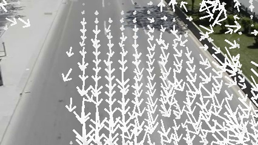

# Video-Abstraction

Video abstraction applied to traffic videos

## How to use:
* clone this repo
* In the terminal: `> python main.py --mode abstract` will run the program and generate a compressed video
* In the terminal: `> python main.py --mode demo` will run the program interactively with intermediate steps
* In case you don't have the dependencies installed. In the terminal, run `pip install -r requirements.txt`
* Tested with python 3.6.7

Note: A trafficVideo.mp4 is in the repo.

## The Steps:
(C:/Users/17807/Desktop/Winter-2019-courses-Material/Computer_Vision/course_project/Implementation_Code/Implementation_Code/source-code/source-code/Video-Abstraction-master/Video-Abstraction-master/output_images/steps.png)
* First, we extract the non-background pixels using GMG algorithm. Each chunk of non-background pixel is boxed by a bounding box.

During this step, a background is reconstructed using the mode (dominant color) of the pixels. This background will be used as a still
background in the final abstracted video. Because video encoders are able to utilize still background and make the video smaller.
Also background noise will be eliminated.

* Second, We compute the neighbor of each bounding box. A neighbor of a bounding box is another bounding box in the subsequent frame which is the most similar to the original one. We will use the neighbors to construct trajectories later.

The similarity is calculated using the mean square error or MSE of bounding box corner distances. If a bounding boxes have a too large a minimum MSE with subsequent boxes, the subsequent boxes will not count as neighbors. This eliminates part of randomly appearing dynamics in the video. After this step, all boxes in a same trajectory should be connected as neighbors.

In the image shown above, the green boxes are from the last frame, and the white boxed are being chosen as neighbors of the greens.

* Third, we concatenate all neighbors to form trajectories.

After this step, we store each group of concatenated boxes with their appearing time together. Each group is a standalone trajectory with continuous movements. Single frames that have no neighbors are left out. There will still be many short trajectories caused by random background noise.

* Fourth, we filter out trajectories that only lasts fraction of seconds to get only car trajectories.

* At last, non-overlapping car trajectories are merged to a video.
## Future Work:

We worked out a functionality that subdivides the video into small chunks and shows the average object moving velocity with corresponding arrow length and brightness.

This is also a kind of video substraction.

Also this could improve our results in multiple ways. We can use the velocity field to remove anomalies in the video, for example a cat running across street would have different velocities with the cars.

This can also help us determine road orientation and road area, to exclude for example walking people on the side.

Also this needs to be improved. As shown above, upper areas shows a decrease in velocity, which is really caused by unmoving bounding box corners as we're summing up the velocity for all four corners. We should account for edge situations and exclude unmoving corners later.

